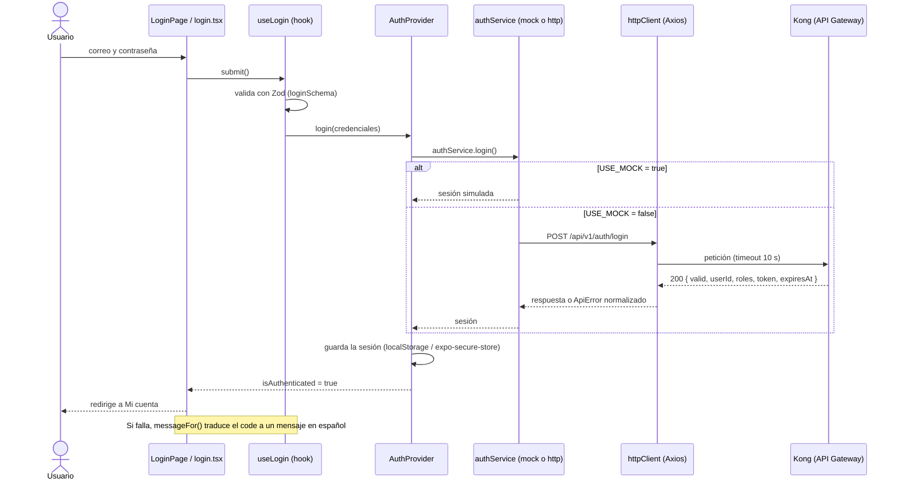

# Arquitectura del frontend

Este documento define el **framework y la estructura** del frontend de Vitalis · RIBAS. Todo
código nuevo —lo escriba una persona o un asistente— parte de aquí: se agrega dentro de la
estructura existente, nunca desde cero ni en carpetas nuevas en la raíz.

## 1. Stack y por qué

| Parte        | Tecnología                                               | Motivo                                                               |
| ------------ | -------------------------------------------------------- | -------------------------------------------------------------------- |
| Web          | React 19 + Vite + TypeScript estricto                    | ADR del grupo que fija React como framework de frontend              |
| Estilos web  | Tailwind CSS 3 + componentes shadcn/ui                   | ADR del grupo que fija Tailwind; shadcn/ui evita otra librería de UI |
| Móvil        | Expo (React Native) + Expo Router + NativeWind           | Mismo lenguaje, mismos tokens de Tailwind y misma lógica que la web  |
| Formularios  | React Hook Form + Zod                                    | Validación declarativa y tipos derivados del esquema                 |
| HTTP         | Axios                                                    | Interceptores para el token Bearer y el cierre de sesión ante un 401 |
| Código común | npm workspaces + `@ribas/shared` y `@ribas/shared-react` | Una sola copia de tipos, esquemas, constantes, servicios y hooks     |

Las decisiones del frontend con trade-offs están registradas en [`docs/adr/`](adr/README.md)
(ADR-011 a ADR-015). **Toda decisión de arquitectura nueva necesita su ADR antes de
implementarse.**

Estas elecciones siguen el Tech Radar y los ADR del proyecto (documentación de arquitectura del
curso). No se agregan frameworks ni librerías de interfaz sin un ADR nuevo. Tailwind se mantiene
en la versión 3 en ambas apps porque NativeWind 4 la exige.

## 2. Cómo se creó cada app

Cada app respeta la convención de su framework; no hay carpetas inventadas.

**`frontend-mobile`** se generó con el scaffolding oficial de Expo y después se le agregó Expo
Router siguiendo la guía de instalación manual:

```bash
npx create-expo-app@latest frontend-mobile --template blank-typescript
npx expo install expo-router react-native-safe-area-context react-native-screens \
  expo-linking expo-constants expo-status-bar
```

**`frontend-web`** tiene exactamente la estructura de la plantilla oficial `react-ts` de Vite
(`index.html`, `vite.config.ts`, `public/`, `src/main.tsx`, `src/App.tsx`). El comando
equivalente es:

```bash
npm create vite@latest frontend-web -- --template react-ts
```

En este repositorio esos archivos se escribieron a mano siguiendo esa plantilla, porque el
asistente interactivo de Vite no se puede ejecutar de forma desatendida. El resultado es el
mismo y cualquiera puede regenerarlo con el comando anterior y comparar.

**shadcn/ui** está configurado con `components.json` (lo que produce `npx shadcn@latest init`) y
los componentes de `src/components/ui` siguen su convención: se copian al proyecto y se editan.
Para agregar uno nuevo: `npx shadcn@latest add <componente>` dentro de `frontend-web`.

**Lo que se configuró encima del scaffolding:**

- Tailwind (`tailwind.config.js` con los tokens `primary`, idénticos en web y móvil).
- NativeWind en móvil (`babel.config.js`, `metro.config.js`, `global.css`).
- Alias `@/` → `src/` en ambas apps.
- npm workspaces en el `package.json` raíz, con `packages/shared` y `packages/shared-react`.
- Una sola configuración de Prettier (`.prettierrc.json`) y una base de ESLint
  (`eslint.base.cjs`) en la raíz; cada parte las extiende.
- ESLint, Prettier, Vitest (web y shared) y Jest con `jest-expo` (móvil).

## 3. Estructura de carpetas

```
frontend-web/
  index.html            Punto de entrada de Vite
  vite.config.ts        Vite + Vitest + alias @/
  components.json       Configuración de shadcn/ui
  public/               Archivos estáticos (favicon)
  src/
    main.tsx            Arranque: monta <App /> dentro del Router
    App.tsx             Tabla de rutas
    pages/              Una pantalla por archivo; solo arma la interfaz
    features/<modulo>/  Un módulo de negocio (ver abajo)
    components/ui/      Componentes shadcn/ui: no conocen la API ni la sesión
    components/layout/  Cabecera, pie y contenedores de página
    api/                Instancia de Axios (httpClient)
    config/             Variables de entorno (env.ts)
    lib/                Utilidades de plataforma: sessionStore, cn
    __tests__/          Pruebas (*.spec.ts[x])

frontend-mobile/
  app.json              Configuración de Expo
  src/
    app/                Rutas de Expo Router (equivale a pages/ + App.tsx)
      _layout.tsx       Fuentes, AuthProvider y navegación raíz
      (protected)/      Grupo de rutas con guardián de sesión
    features/<modulo>/  Igual que en web
    components/ui/      Igual que en web, con componentes de React Native
    components/layout/  Screen, AuthCard, Brand
    api/, config/, lib/ Igual que en web (sessionStore usa expo-secure-store)
    __tests__/          Pruebas (*.spec.tsx)

packages/shared/
  src/index.ts          Único punto de entrada (@ribas/shared)
  src/constants/        ROUTES, API_ENDPOINTS, ROLES, STORAGE_KEYS, ERROR_MESSAGES
  src/api/              ApiError, messageFor, createHttpClient
  src/auth/             Contrato, esquemas Zod, sesión y servicios (http y mock)
  src/profile/          Perfil de donante, medallas y servicios (http y mock)
  src/content/          Textos compartidos de la pantalla de inicio
  src/lib/              format, mock
  src/__tests__/        Pruebas unitarias

packages/shared-react/
  src/index.ts          Único punto de entrada (@ribas/shared-react)
  src/                  createSessionContext, useSessionCountdown, useBadges
  src/__tests__/        Pruebas de los hooks
```

Cada módulo de `features/` tiene la misma forma:

```
features/<modulo>/
  components/   Componentes del módulo (usan hooks, nunca Axios)
  hooks/        useX.ts: estado y casos de uso
  services/     xService.ts: instancia creada con la factory de @ribas/shared
  types.ts      Tipos propios del módulo
  schemas.ts    Esquemas Zod de sus formularios (si tiene)
  index.ts      API pública: lo único que se importa desde fuera
```

## 4. Patrones

| Patrón                   | Regla                                                                                         | Dónde verlo                                          |
| ------------------------ | --------------------------------------------------------------------------------------------- | ---------------------------------------------------- |
| Feature-based            | El código se agrupa por módulo de negocio, no por tipo de archivo                             | `src/features/auth`, `src/features/profile`          |
| Barrel exports           | Una feature solo se importa por su `index.ts`; ESLint lo exige                                | `features/*/index.ts`, regla `no-restricted-imports` |
| Service + Strategy       | Una interfaz, dos implementaciones (`http` y `mock`) y una factory que elige según `USE_MOCK` | `packages/shared/src/auth/createAuthService.ts`      |
| Custom hooks             | La lógica vive en hooks; páginas y componentes solo pintan                                    | `useLogin`, `useForgotPassword`, `useProfile`        |
| Context solo para sesión | Un único contexto global (`AuthProvider` + `useSession`); el resto es estado local            | `features/auth/components/AuthProvider.tsx`          |
| Constantes centralizadas | Rutas, roles, claves y mensajes en un solo archivo cada uno, sin strings repetidos            | `packages/shared/src/constants/`                     |
| UI sin lógica            | `components/ui` no importa nada de `features/`, `api/` ni `@ribas/shared`                     | `src/components/ui`                                  |

## 5. Cómo agregar un módulo nuevo (ejemplo: `features/campaigns`)

1. **Contrato y lógica común** en `packages/shared/src/campaigns/`: `types.ts`, `schemas.ts`
   (Zod), `campaignService.http.ts`, `campaignService.mock.ts` y `createCampaignService.ts`.
   Exporta lo público desde `packages/shared/src/index.ts` y agrega el endpoint a
   `constants/routes.ts`.
2. **Ruta**: agrega `CAMPAIGNS: '/campanas'` a `ROUTES`.
3. **Feature en cada app**: crea `src/features/campaigns/` con
   `services/campaignService.ts` (llama a la factory con `env.USE_MOCK` y `http`),
   `hooks/useCampaigns.ts`, `components/CampaignList.tsx` e `index.ts`.
4. **Pantalla**: en web, `src/pages/CampaignsPage.tsx` y su `<Route>` en `App.tsx`; en móvil,
   `src/app/campanas.tsx` (o dentro de `(protected)/` si exige sesión).
5. **Pruebas**: el mock y los esquemas en `packages/shared/src/__tests__/`; el flujo de la
   pantalla en `src/__tests__/` de cada app.
6. **Verifica** con `npm run lint`, `npm run typecheck` y `npm test` antes de abrir el PR.

## 6. Flujo de trabajo

- **GitFlow**: cada tarea sale de `develop` en una rama `feature/<nombre>` y vuelve a `develop`
  por pull request.
- **Conventional Commits**: `feat(web): ...`, `fix(mobile): ...`, `refactor(auth): ...`,
  `test: ...`, `docs: ...`, `chore: ...`.
- **Revisión**: el PR lo aprueba un compañero distinto del autor y debe tener el CI en verde
  (`.github/workflows/frontend-ci.yml`).
- **Contrato del API**: [`docs/api/frontend-contract.openapi.yaml`](api/frontend-contract.openapi.yaml)
  es la fuente de verdad; todo PR que cambie el contrato lo actualiza (`npm run lint:api`).
- **Pruebas E2E**: los flujos críticos (hoy, el de autenticación) tienen pruebas de Playwright
  en `frontend-web/e2e/` que corren en el CI sobre el build de producción.
- **Despliegue**: la web se empaqueta con `frontend-web/Dockerfile` (nginx) para Docker Swarm;
  las variables `VITE_*` se fijan al construir la imagen.
- **Con asistentes de IA**: las reglas están en [`CLAUDE.md`](../CLAUDE.md). Se le piden
  borradores dentro de esta estructura; lo que genera pasa por la misma revisión y el mismo CI.

## 7. Flujo de login



En las peticiones siguientes, `httpClient` agrega `Authorization: Bearer <token>`; si el backend
responde 401, avisa a `AuthProvider`, que cierra la sesión y lleva a Login.

## 8. Decisiones conocidas y sus límites

**Dónde se guarda el token.** En web la sesión está en `localStorage` (clave `ribas_session`).
Es una decisión consciente para el piloto: es simple, funciona sin backend y el token nunca
viaja en la URL ni se escribe en consola. Su límite es que un script inyectado (XSS) podría
leerlo. Para producción conviene que el backend entregue el token en una cookie `httpOnly`,
`Secure` y `SameSite`, con protección CSRF; el cambio queda aislado en `lib/sessionStore.ts` y
`api/httpClient.ts`. En móvil el token ya se guarda cifrado con `expo-secure-store` (Keystore en
Android, Keychain en iOS).

`createSessionContext`, `useSessionCountdown`, `useBadges`). Lo que queda en las dos apps es lo
que sí depende de cada una:
**Código que sigue duplicado entre web y móvil.** `@ribas/shared` es TypeScript puro, sin React,
para que no dependa de la plataforma. Por eso estos archivos existen en las dos apps:

| Archivos                                                       | Por qué no están en `shared`                                                                                                 |
| -------------------------------------------------------------- | ---------------------------------------------------------------------------------------------------------------------------- |
| `useSession`, `useProfile`, `useBadges`, `useSessionCountdown` | Son hooks de React; hoy son idénticos y podrían moverse a un paquete `shared-react` si aparece un tercer consumidor          |
| `useLogin`, `useForgotPassword`                                | Web usa `register` de React Hook Form y móvil usa `control`                                                                  |
| `AuthProvider`                                                 | Web restaura la sesión de forma síncrona y navega con React Router; móvil la lee de forma asíncrona y navega con Expo Router |
| `lib/sessionStore.ts`, `config/env.ts`, `api/httpClient.ts`    | Dependen del almacenamiento y de las variables de entorno de cada plataforma                                                 |
| Componentes de `components/` y de `features/*/components`      | HTML en web, componentes nativos en móvil                                                                                    |

**Bloqueo del modo simulado.** El contador de intentos fallidos vive en memoria y se reinicia al
recargar. El bloqueo real (QA-26) lo aplica el backend con el código `ACCOUNT_LOCKED`.

**Contratos pendientes.** El DD aún no define `POST /api/v1/auth/forgot-password` ni
`GET /api/v1/donors/{userId}`; el frontend usa esas rutas como propuesta (`API_ENDPOINTS`).
